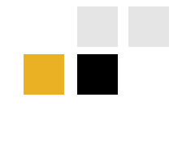

Trata-se de um projeto web para um Instituto de Beleza e Estética. 

- Na primeira fase, será entregue uma landing page com informações básicas, apresentação dos produtos e serviços, apresentação dos profissionais e do próprio estúdio (estabelecimento comercial do Instituto);
- Em um segundo momento, serão implementados recursos para que o conteúdo da página possa ser atualizado a partir de um painel Admin. -> atualmente estou nesta fase
- Finalmente, o sistema web será transformado em um WebApp com sistema de carrinhos de compra, agendamento de procedimentos e um blog.

<br>

<h2>Paleta básica de cores</h2>
<br>


<h2>Singleton</h2>
<br>
Algo interessante que implementei nesse projeto foi o Design Pattern Singleton para o model Feedbacks. Esse model basicamente reúne duas variáveis globais contendo iframes (tags html para incorporação de conteúdo), sendo um iFrame de video (para incorporar vídeo do YouTube) e um iFrame de fotos, para incorporar uma galeria de fotos de terceiros (como Albumizr, por exemplo).
A implementação de Sigleton em Django é realmente muito simples, bastando sobreescrever o método save(), de forma a sempre settar pk = 1 antes de salvar o modelo no banco:

```
def save(self, *args, **kwargs):
        self.pk = 1
        super().save(*args, **kwargs)
```
